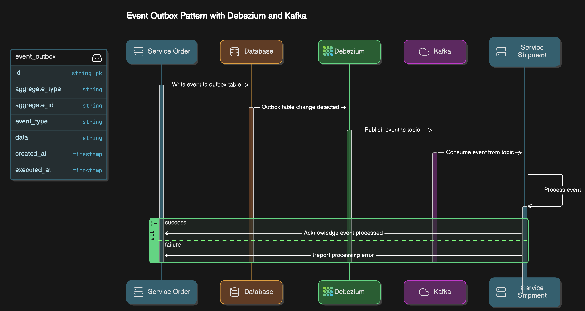

# CDC-SQLSERVER

This repository contains a sample project that demonstrates how to use Debezium to capture change data from a SQL Server database and stream it to Kafka.

## Workflow

The project follows this general workflow:
1. SQL Server generates change data capture (CDC) events for modifications to the Employee table.
2. Debezium SQL Server connector reads the CDC events from SQL Server.
3. The connector transforms these events into Kafka Connect format.
4. The transformed events are written to a Kafka topic named "Employee".
5. Consumers can then read from this Kafka topic to process the change events.

This setup allows for real-time tracking and processing of data changes in the SQL Server database.

## How to run
To run the project, execute the following command:

```sh
    docker compose up -d
```

Then checkout messages from the topic using the kafka-ui at http://localhost:8085/ or using the kafka-console-consumer command line tool bellow:
```sh
 docker compose exec kafka /bin/kafka-console-consumer --bootstrap-server kafka:9092 --from-beginning --property print.key=true  --topic  Employee
```

## Reference Links
For more information on Debezium and CDC with SQL Server, please refer to the following resources:
- [Change Data Capture for Auditing SQL Server](https://www.sqlshack.com/change-data-capture-for-auditing-sql-server/)
- [Debezium Documentation](https://debezium.io/documentation/)
- [Debezium SQL Server Connector](https://debezium.io/documentation/reference/stable/connectors/sqlserver.html)
- [Change Data Capture in SQL Server](https://docs.microsoft.com/en-us/sql/relational-databases/track-changes/about-change-data-capture-sql-server)
- [Kafka Documentation](https://kafka.apache.org/documentation/)
